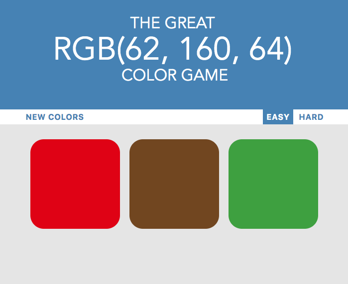
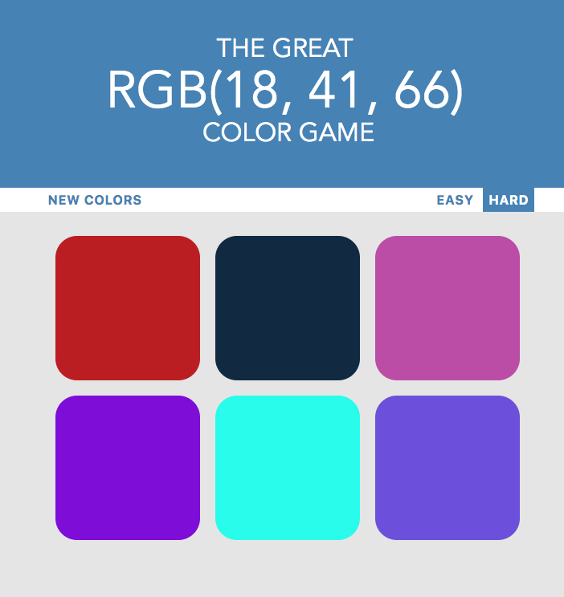
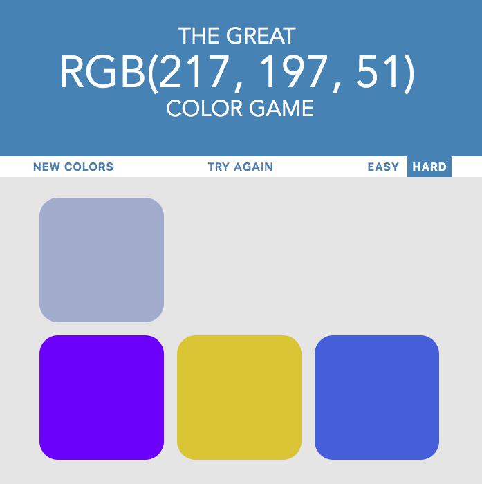
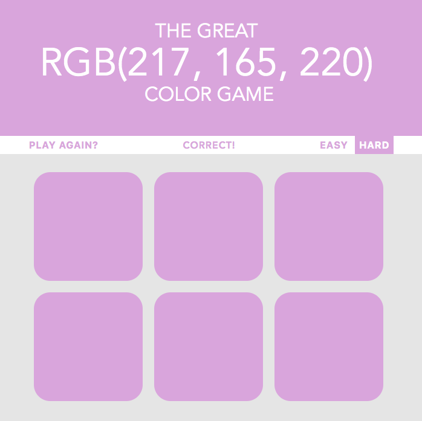

# RGB GAME
[button url="https://lhn136.github.io/ColorGame/colorGame.html"]
## Creating a RGB game to enhance your color guessing skills

This game has 3 "setting" buttons

"New Colors" will reset the board and pick a new color

### Easy has only 3 squares

### Hard has 6 squares 

#### upon clicking the board will reset all the colors

#### squares will disappear to show user that it's incorrect

### When user wins
#### background, buttons, and squares will changed to the presented RGB on top
#### in our case RGB(217, 165, 220) will fill out the colors

